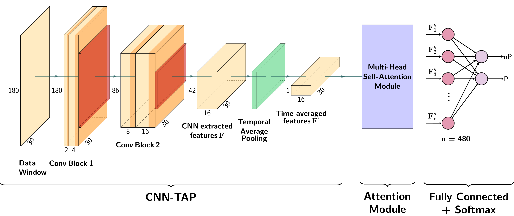

# L-SFAN



## Introduction

This repository contians the code for the [paper](https://ieeexplore.ieee.org/document/10891565) *L-SFAN: Lightweight Spatially Focused Attention Network for Pain Behavior Detection*.

To run the code on the EmoPain dataset you will need both the raw data of joints, angles, sEMG and labels, as well as the .xls file with the column description mentioned inside the processing code.

## Code and files description

Thhe code is structured as follows:
```
├── src
│   ├── data_preprocessing
│   │   ├── data_augmentation.py
│   │   ├── joint_parser.py
│   │   ├── lablel_parser.py
│   │   ├── normalization.py
│   │   └── parser.py
│   ├── dataset.py
│   ├── loops.py
│   ├── loso_cv.py
│   ├── cam.py
│   ├── utils.py
│   ├── models.py
│   └── test.py
└── weights
    └── L_SFAN
```

###  Data preprocessing

For the use with the EmoPain dataset, preprocessing code is included in the `src/data_preprocessing` folder to adapt the format of the data.

1. Run the label parser 
2. Run the joint parser to create .mats with the method described in the paper
3. Run the augmentation script
4. Run the normalization script

### Testing scripts

The weights are stored in the `src/weights/L_SFAN` folder. To run the model in testing mode, use test.py. The model architecture, as well as the *2D-CNN-TAP* and *2D-CNN-SAP* as described in the paper are defined inside the models.py file.

## Citation

```
@ARTICLE{ortigosolsfan2025,
  author={Ortigoso-Narro, Jorge and Diaz-de-Maria, Fernando and Dehshibi, Mohammad Mahdi and Tajadura-Jiménez, Ana},
  journal={IEEE Sensors Journal}, 
  title={L-SFAN: Lightweight Spatially Focused Attention Network for Pain Behavior Detection}, 
  year={2025},
  volume={25},
  number={10},
  pages={18409-18418},
  keywords={Pain;Sensors;Feature extraction;Long short term memory;Convolutional neural networks;Sensor phenomena and characterization;Computer architecture;Estimation;Data mining;Computational     modeling;Convolutional neural network (CNN);global average pooling (GAP);motion sensors;pain-related behavior;self-attention;spatial patterns;surface electromyography (sEMG) sensors},
  doi={10.1109/JSEN.2025.3540415}}
```
